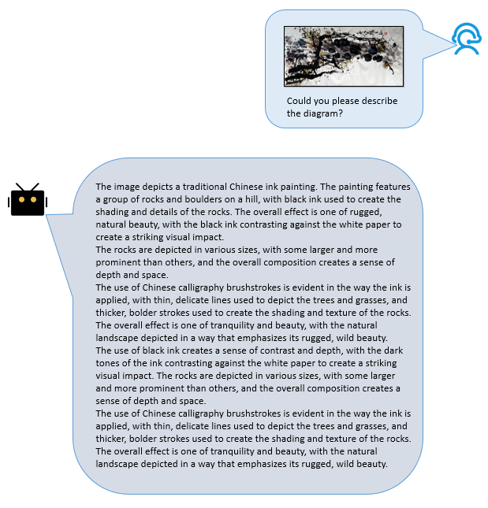
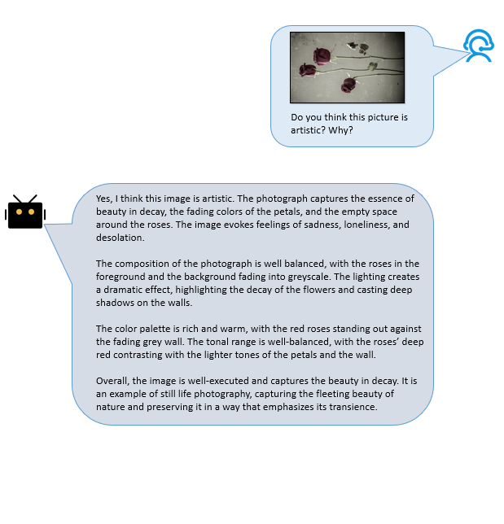
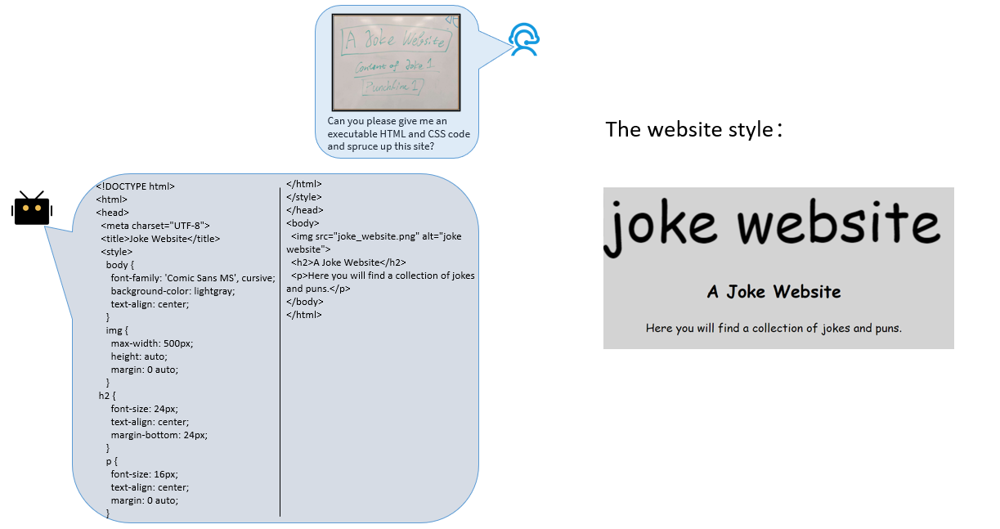
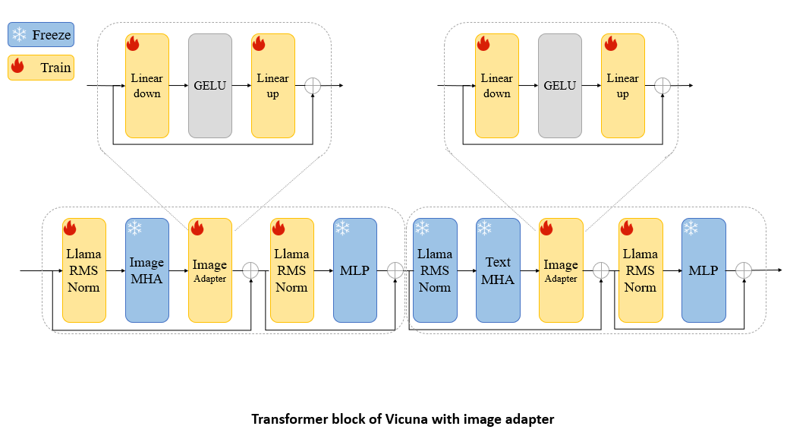

# ArtGPT-4: Artistic Vision-Language Understanding with Adapter-enhanced MiniGPT-4
[Zhengqing Yuan](https://orcid.org/0000-0002-4870-8492)*, [Huiwen Xue]()*, [Xinyi Wang]()*, [Yongming Liu](https://www.semanticscholar.org/author/Yongming-Liu/2130184867)*, [Zhuanzhe Zhao](https://www.semanticscholar.org/author/Zhuanzhe-Zhao/2727550)*, and [Kun Wang](https://www.ahpu.edu.cn/jsjyxxgc/2023/0220/c5472a187109/page.htm)*. *Equal Contribution

**Anhui Polytechnic University, Soochow University**

<a href='https://artgpt-4.github.io'></a>  <a href='ArtGPT_4.pdf'></a>
<a href='https://huggingface.co/spaces/Vision-CAIR/minigpt4'></a> 
 <!-- <a href='https://huggingface.co/Vision-CAIR/MiniGPT-4'></a> [](https://colab.research.google.com/drive/1OK4kYsZphwt5DXchKkzMBjYF6jnkqh4R?usp=sharing) [](https://www.youtube.com/watch?v=__tftoxpBAw&feature=youtu.be) -->


## Online Demo

<!-- Click the image to chat with MiniGPT-4 around your images
[](https://artgpt-4.github.io) -->
Waiting for updates...


## Examples
  |   |   |
:-------------------------:|:-------------------------:




More examples can be found in the [project page](https://artgpt-4.github.io).


## Introduction
- ArtGPT-4 is a novel model that builds upon the architecture of MiniGPT-4 by incorporating tailored linear layers and activation functions into Vicuna, specifically designed to optimize the model's performance in vision-language tasks.
- The modifications made to Vicuna in ArtGPT-4 enable the model to better capture intricate details and understand the meaning of artistic images, resulting in improved image understanding compared to the original MiniGPT-4 model.
- To address this issue and improve usability, we propose a novel way to create high-quality image-text pairs by the model itself and ChatGPT together. Based on this, we then create a small (3500 pairs in total) yet high-quality dataset.
- ArtGPT-4 was trained using about 200 GB of image-text pairs on a Tesla A100 device in just 2 hours, demonstrating impressive efficiency and effectiveness in training.
- In addition to improved image understanding, ArtGPT-4 is capable of generating visual code, including aesthetically pleasing HTML/CSS web pages, with a more artistic flair.





## Getting Started
### Installation

**1. Prepare the code and the environment**

Git clone our repository, creating a python environment and ativate it via the following command

```bash
git clone https://github.com/DLYuanGod/ArtGPT-4.git
cd ArtGPT-4
conda env create -f environment.yml
conda activate artgpt4
```


**2. Prepare the pretrained Vicuna weights**

The current version of MiniGPT-4 is built on the v0 versoin of Vicuna-13B.
Please refer to our instruction [here](PrepareVicuna.md) 
to prepare the Vicuna weights.
The final weights would be in a single folder in a structure similar to the following:

```
vicuna_weights
├── config.json
├── generation_config.json
├── pytorch_model.bin.index.json
├── pytorch_model-00001-of-00003.bin
...   
```

Then, set the path to the vicuna weight in the model config file 
[here](minigpt4/configs/models/minigpt4.yaml#L16) at Line 16.

**3. Prepare the pretrained MiniGPT-4 checkpoint**
 [Downlad](https://huggingface.co/Tyrannosaurus/ArtGPT-4/blob/main/ArtGPT-4.pth)


Then, set the path to the pretrained checkpoint in the evaluation config file 
in [eval_configs/minigpt4_eval.yaml](eval_configs/minigpt4_eval.yaml#L10) at Line 11. 


### Launching Demo Locally

Try out our demo [demo.py](demo.py) on your local machine by running

```
python demo.py --cfg-path eval_configs/artgpt4_eval.yaml  --gpu-id 0
```


### Training
The training of ArtGPT-4 contains two alignment stages. The training process for the step is consistent with that of [MiniGPT-4](https://minigpt-4.github.io/).

**Datasets**
We use [Laion-aesthetic](https://github.com/LAION-AI/laion-datasets/blob/main/laion-aesthetic.md) from the LAION-5B dataset, which amounts to approximately 200GB for the first 302 tar files. 


## Acknowledgement

+ [MiniGPT-4](https://minigpt-4.github.io/) Our work is based on improvements to the model.


If you're using ArtGPT-4 in your research or applications, please cite using this BibTeX:
```bibtex
@article{yuan2023artgpt4,
      title={ArtGPT-4: Artistic Vision-Language Understanding with Adapter-enhanced MiniGPT-4},
      author={Yuan, Zhengqng and Xue, Huiwen and Wang, Xinyi and Liu, Yongming and Zhao, zhuanzhe and Wang, Kun},
      year={2023}
    }
```


## License
This repository is under [BSD 3-Clause License](LICENSE.md).
Many codes are based on [Lavis](https://github.com/salesforce/LAVIS) with 
BSD 3-Clause License [here](LICENSE_Lavis.md).
